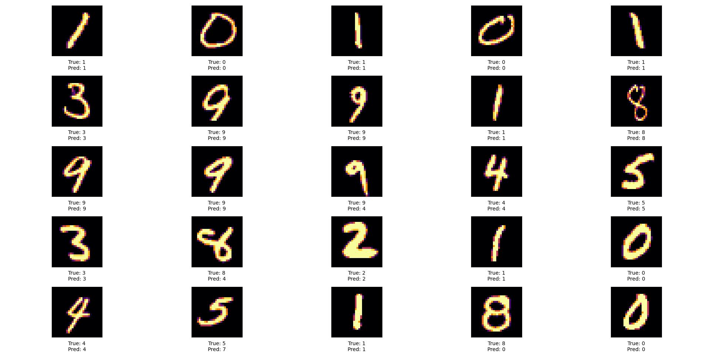

# MNIST Neural Network Classifier 
This project implements a neural network from scratch using Numpy to classify handwritten digits from the MNIST dataset. 
## Project Overview 
The project includes a custom implementation of a fully connected neural network with configurable layers and activation functions. The network is trained to recognize and classify handwritten digits from the MNIST dataset. 
## Features 
- Custom neural network architecture using only Numpy for matrix operations.
- Activation functions: Sigmoid, ReLU, Leaky ReLU, and Tanh. 
- Functions for forward propagation and backpropagation. 
- Gradient descent optimization for network training. 
- Evaluation of model accuracy on test data. 
- Visualization of predictions using Matplotlib.

### Usage Instructions 
1. **Prerequisites**
   - Ensure Python 3.7.9 or a newer version is installed on your system.
   - A basic understanding of Python and neural networks is recommended.

2. **Setup**
   - Clone the repository or download the project files to your local machine.
   - Ensure that `MNIST.py`, `Layer_dense.py`, `Network.py`, and any other required files are located in the same directory.

3. **Install Dependencies**
   - In your project directory, run `pip install -r requirements.txt` to install necessary libraries.
   - If you encounter issues, install the libraries individually as listed in the `requirements.txt` file using `pip install`.

4. **Prepare Your Data**
   - The MNIST dataset is automatically loaded and preprocessed by the `MNIST.py` script.
   - Each image, originally a 28x28 pixel 2D array, is flattened into a 1D array of 784 features.
   - The training and testing datasets are therefore transformed into 2D arrays with shapes `(60000, 784)` and `(10000, 784)`, respectively, ready for network input.

5. **Run the Neural Network**
   - Open your command line interface and navigate to the project directory.
   - Run the script using the command `python MNIST.py`.
   - The script will manage the loading of data, training of the neural network, and evaluation of its performance.

6. **Monitor Training**
   - Keep an eye on the console for training progress, including updates on loss and accuracy metrics.

7. **Evaluate Results**
   - Upon completion of training, the script will display the final performance metrics on the MNIST dataset.
   - It will also show a 5x5 grid image with a sample of test data for visual evaluation.

8. **Customizing the Neural Network**
   - You can customize the network architecture in the `MNIST.py` file.
   - Import the `NeuralNetwork` and `Layer_dense` classes:
     ```python
     from Network import NeuralNetwork
     from Layer_Dense import Layer_dense
     ```
   - Create a `NeuralNetwork` instance and add layers as needed:
     ```python
     network = NeuralNetwork()
     network.add_layer(Layer_dense(input_size, number_of_neurons))
     # Add more layers if necessary
     ```
   - Load your dataset (use MNIST or a custom dataset) and ensure it is in the correct format.

9. **Training and Evaluating Your Network**
   - Train the network using:
     ```python
     network.train(data, labels, epochs, batch_size, learning_rate)
     ```
   - Evaluate the network's performance on test data:
     ```python
     test_accuracy = network.evaluate(test_X[1:5000], test_y[1:5000])
     print(f"Test Accuracy: {test_accuracy}%")
     ```

### Additional Notes

- **Layer Configuration**: Adjust the number and size of layers to suit your specific task.
- **Data Handling**: Ensure your data is formatted correctly for the network. The class handles data normalization, but data should be clean and appropriately shaped.
- **Tuning Parameters**: Experiment with different epochs, batch sizes, and learning rates to optimize performance for your specific problem.
## Results

# How does it work?
 In the following chapters of these notes, we'll briefly look at all the code to understand its inner workings. Starting with:
# MNIST
In MNIST.py an example code showcases an implementation of this project to tackle the MNIST dataset for image classification.
## Implementation Overview
- **Data Preparation**: The MNIST dataset is loaded, with each image reshaped into a 1D array (`28x28` pixels to `784` features) to match the input size of the neural network.
- **Hyperparameters**:
	- Input Size: `784` (flattened `28x28` images)
	- Hidden Layer Size: `64`
	- Output Size: `10` (digits `0-9`)
	- Epochs: `10`
	- Batch Size: `32`
	- Learning Rate: `0.001`
- **Network Architecture**: The network comprises a hidden layer with ReLU activation and an output layer with Sigmoid activation.
- **Training**: The network is trained on the MNIST dataset using forward and backward propagation, with training progress displayed through a tqdm progress bar.
### Code Snippet
```python
# Neural network creation and training
network = NeuralNetwork()
network.add_layer(Layer_dense(784, 64, 'ReLU'))
network.add_layer(Layer_dense(64, 10, 'Sigmoid'))
network.train(train_X, train_y, 10, 32, 0.001)
```
The NeuralNetwork class is the central branch of this project as it connects and uses the Utils and Layer_Dense scripts that allow the network to automatically train without lots of code. 
# Utils
The Utils script stores two important functions that will make transcribing and selecting batches of data a lot easier to handle. So far the functions in this file are:
## def batch
```python
def batch(data, labels, batch_size):
        for i in range(0, len(data), batch_size):
            yield data[i:i + batch_size], labels[i:i + batch_size]
```
This function lets us collect batches (or subsets) of our total data.  
The `batch` function takes three parameters:
1. `data`: The complete set of data points (features).
2. `labels`: The corresponding labels for the data points.
3. `batch_size`: The size of each batch.
##### Example 
```python
data = np.array([1, 2, 3, 4, 5, 6, 7, 8, 9, 10])
labels = np.array(['a', 'b', 'c', 'd', 'e', 'f', 'g', 'h', 'i', 'j'])
```
In this code we have two np arrays called data and labels. If we wanted to separate these arrays in batches of three we can call:
```python
for b_data, b_labels in batch(data, labels, 3): 
	print(f"Batch data: {b_data}, Batch labels: {b_labels}")
```
This for loop declares the variables b_data and b_labels equal to the arrays yielded by the batch function after one of it's iteration. Note that:

1. *1st iteration:*
	- `i = 0, as the loop increments `i` by the batch size, which is 3.
	- `b_data` = `data[0:3]` = `[1, 2, 3]`.
	- `b_labels` = `labels[0:3]` = `['a', 'b', 'c']`.
2. *2nd Iteration:*
	- `i = 3`, as the loop increments `i` by the batch size, which is 3.
	- `b_data` = `data[3:6]` = `[4, 5, 6]`.
	- `b_labels` = `labels[3:6]` = `['d', 'e', 'f']`.
	The second batch consists of the next three elements from both `data` and `labels`.
3. *3rd Iteration:*
	- `i = 6`, following the pattern of incrementing by the batch size.
	- `b_data` = `data[6:9]` = `[7, 8, 9]`.
	- `b_labels` = `labels[6:9]` = `['g', 'h', 'i']`.
	The third batch includes elements 7, 8, and 9 from `data` and their corresponding labels.
4. *4th Iteration:*
	- `i = 9`, again incremented by 3.
	- `b_data` = `data[9:12]` = `[10]`.
	- `b_labels` = `labels[9:12]` = `['j']`.
	In this final iteration, the batch is smaller because there are no more elements left in `data` and `labels` to make a full batch of 3. The function handles this gracefully by just returning the remaining elements.

## Def one-hot-encode
The `one_hot_encode` function is used for converting categorical labels into a one-hot encoded format. One-hot encoding is a technique where each categorical label is converted into a binary vector representing the presence or absence of each class. 
#### Function Explanation:
- `np.eye(num_classes)`: Creates an identity matrix of size `num_classes x num_classes`. Each row in this matrix represents a one-hot encoded vector for a class.
- `[labels]`: Uses the `labels` array to index into the identity matrix. Each element in the `labels` array is used as an index to select the corresponding row from the identity matrix, resulting in a one-hot encoded vector for that label.
##### Example:
Suppose you have a set of labels for a classification task with 3 classes. Here's how the `one_hot_encode` function operates:

```python
import numpy as np

labels = np.array([0, 2, 1, 0, 2])  # Example labels
num_classes = 3  # Number of classes

def one_hot_encode(labels, num_classes):
    return np.eye(num_classes)[labels]

encoded_labels = one_hot_encode(labels, num_classes)
print(encoded_labels)
```

Outputs:

```Python
[[1. 0. 0.]
 [0. 0. 1.]
 [0. 1. 0.]
 [1. 0. 0.]
 [0. 0. 1.]]
```

- The label 0 is encoded as `[1. 0. 0.]`.
- The label 1 is encoded as `[0. 1. 0.]`.
- The label 2 is encoded as `[0. 0. 1.]`.

Each row in the output is a one-hot encoded vector corresponding to a label from the original labels array. 
# Layer_Dense.py
The Layer_Dense script includes a class consisting of all the available activation functions and most importantly the Layer_Dense object.
## Activation Class 

This class contains the following activation functions: `Sigmoid`, `ReLU`, `Leaky`, `ReLU`, and Tanh and their corresponding derivatives named with a d and a dash like so: `d_relu`, `d_sigmoid` etc.

To use any function in this class simply `from Layer_dense import Activation` and `x = Activation.relu(inputs)` and `x` will simply be an array of the shape of inputs where every single entry has had ReLU applied to it

## Layer_dense Class

The `Layer_dense` class implements a fully connected neural network layer with customizable activation functions. It is designed for use in building and training neural networks from scratch.
### Key Features
- **Fully Connected Layer**: Implements a dense layer where each neuron is connected to all neurons in the previous layer.
- **Customizable Activation Functions**: Supports Sigmoid, ReLU, Tanh, and Leaky ReLU activations, with extendability for more.
- **Forward Propagation**: Computes the weighted sum of inputs and applies the activation function.
- **Backpropagation Support**: Facilitates the calculation of gradients for backpropagation.
- **Parameter Update**: Allows updating the layer's weights and biases using gradient descent.
### Initialization
- `number_inputs` (int): Number of input features.
- `number_outputs` (int): Number of neurons in the layer.
- `activation_function` (str): Type of activation function to use.

Weights and biases are initialized with small random values for symmetry breaking.
### Supported Activation Functions
- **Sigmoid**: Outputs values between 0 and 1, useful for binary classification.
- **ReLU**: Passes positive values and blocks negatives, useful for non-linear transformations.
- **Tanh**: Scales output between -1 and 1.
- **LeakyReLU**: Variation of ReLU that allows small negative values.
### Methods
 - `.Forward(batch_inputs)`: Computes the output of the layer for a given batch of inputs.
-  `.BackProp(dvalues)`: Performs backpropagation for the layer using the predictions error and subsequently the layer's error, calculating gradients with respect to inputs and weights.
-  `.update_parameters(learning_rate)`: Updates the layer's weights and biases based on calculated gradients and a given learning rate.
### Example Usage
```python
import numpy as np 
from Layer_dense import Layer_dense 
# Initialize a dense layer with 5 inputs, 10 outputs, and ReLU activation
layer = Layer_dense(5, 10, 'ReLU')
# Example input: 3 samples, 5 features each
inputs = np.random.randn(3, 5)
# Forward pass
output = layer.Forward(inputs)
# Backpropagation with dummy gradients (assuming 10 outputs)
dvalues = np.random.randn(3, 10)
gradients = layer.BackProp(dvalues)
# Update parameters with a learning rate of 0.01
layer.update_parameters(0.01)
```
#### Integration in Neural Networks
```python
network = NeuralNetwork() 
network.add_layer(Layer_dense(784, 128, 'ReLU')) 
network.add_layer(Layer_dense(128, 10, 'Sigmoid'))
```

# Network
## NeuralNetwork
The `NeuralNetwork` class is designed to represent a multi-layer neural network. It provides a flexible structure for building and training neural networks with varying architectures.
### Key Features

- **Layer Management**: Facilitates adding multiple layers to the network.
- **Forward Propagation**: Sequentially processes inputs through all layers.
- **Backpropagation**: Supports backward propagation of errors for training.
- **Parameter Update**: Implements parameter updates for all layers using gradient descent.
- **Prediction**: Ability to predict outputs for given inputs.
- **Accuracy Calculation**: Computes the accuracy of predictions against true labels.
### Initialization

The neural network is initialized with an empty list of layers:
```python
network = NeuralNetwork()
```
### Methods

-  `.add_layer(layer)`: Adds a layer to the neural network.
-  `.forward(inputs)`: Performs a forward pass through the network by sequentially passing the input through each layer.
-  `.backward(loss_gradient)`: Executes the backpropagation algorithm through the network in reverse order, starting from the output layer.
- `.update_parameters(learning_rate)`: Updates the parameters (weights and biases) of each layer in the network based on the gradients computed during backpropagation.
-  `.predict(inputs)`: Predicts the output for given inputs by performing a forward pass and then applying argmax to the final layer's outputs to obtain the predicted class labels.
-  `.calculate_accuracy(predictions, labels)`: Calculates the accuracy of the predictions, comparing them to the true labels. Both inputs are expected to be one-hot encoded.
- `.evaluate`: It evaluates the accuracy of the network by passing a single batch of test data and returning a value for accuracy 
## NeuralNetwork Class: Training Method
The `train` method of the `NeuralNetwork` class is designed to train the neural network using a given dataset. It incorporates forward propagation, loss calculation, backpropagation, and parameter updates in a loop to optimize the network's weights and biases. Below is an explanation of how this method works:
### Method Definition
```python
def train(self, train_X, train_Y, epochs, batch_size, learning_rate):  
```
### Parameters
- `train_X`: The training data (features).
- `train_Y`: The corresponding labels for the training data.
- `epochs`: The number of times the entire dataset is passed through the network.
- `batch_size`: The number of samples in each batch for training.
- `learning_rate`: The step size used for updating the weights during training.

### Training Loop Breakdown

1. **Initialization**:
   At the start of each training epoch, we initialize `epoch_loss` and `epoch_accuracy` to zero. These variables are crucial for tracking the model's performance throughout the epoch.

   ```python
   for epoch in range(number_of_epochs):
       epoch_loss = 0
       epoch_accuracy = 0
       # Further processing in the loop...
   ```

2. **Batch Processing**:
   The dataset is divided into smaller batches using the `batch` function. For a better user experience, we use `tqdm` to create a dynamic progress bar in the console.

   ```python
   from Utils import batch
   from tqdm import tqdm

   for batch_x, batch_y in tqdm(batch(train_data, train_labels, batch_size)):
       # Batch training steps follow...
   ```

3. **Batch Training**:
   - **Normalization**: Each batch of inputs (`batch_x`) is normalized by scaling pixel values to the range [0, 1].
     ```python
     batch_x /= 255.0
     ```
   - **Forward Pass**: The `forward` method of the network processes each batch to produce output predictions.
     ```python
     output = network.forward(batch_x)
     ```
   - **One-Hot Encoding**: Target labels (`batch_y`) are converted into a one-hot encoded format.
     ```python
     batch_y_encoded = one_hot_encode(batch_y, num_classes)
     ```
   - **Loss Calculation**: Cross-entropy loss is computed as a measure of the network's prediction accuracy.
     ```python
     loss = -np.sum(batch_y_encoded * np.log(output + 1e-7)) / batch_size
     epoch_loss += loss
     ```
   - **Accuracy Calculation**: The `calculate_accuracy` function assesses how well the network's predictions match the true labels.
     ```python
     accuracy = calculate_accuracy(output, batch_y)
     epoch_accuracy += accuracy
     ```

4. **Error Gradient Simplification**:
   Simplifying the gradient for the categorical cross-entropy loss function, we use the difference between outputs and encoded labels.
   ```python
   dvalues = output - batch_y_encoded
   ```

5. **Backward Pass and Parameter Update**:
   - **Backward Pass**: Backpropagation is performed using the simplified error gradient, calculating gradients for each network layer.
     ```python
     network.backward(dvalues)
     ```
   - **Parameter Update**: Network parameters (weights and biases) are updated based on the gradients and learning rate.
     ```python
     network.update_parameters(learning_rate)
     ```

6. **Progress Update**:
   After each batch, the `tqdm` progress bar is updated to reflect current loss and accuracy metrics.
   ```python
   tqdm.set_description(f'Epoch {epoch + 1}/{number_of_epochs} | Loss: {epoch_loss / number_of_batches} | Accuracy: {epoch_accuracy / number_of_batches}')
   ```

7. **Epoch Summary**:
   Post-training on all batches, the cumulative epoch loss and accuracy are averaged and reported, providing insights into the network's learning progress.
   ```python
   avg_epoch_loss = epoch_loss / number_of_batches
   avg_epoch_accuracy = epoch_accuracy / number_of_batches
   print(f'Epoch {epoch + 1} completed: Avg. Loss: {avg_epoch_loss}, Avg. Accuracy: {avg_epoch_accuracy}')
   ```

---
# Relevant formulas
## Activation Functions and Their Derivatives 
- **Sigmoid Function and Derivative**: $$\begin{gather} \sigma(x) = \frac{1}{1 + e^{-x}} \\ \frac{d\sigma(x)}{dx} = \sigma(x)(1 - \sigma(x)) \end{gather}$$
- **ReLU (Rectified Linear Unit) and Derivative**: $$\begin{gather} \text{ReLU}(x) = \max(0, x) \\ \frac{d(\text{ReLU}(x))}{dx} = \begin{cases} 1 & \text{if } x > 0 \\ 0 & \text{otherwise} \end{cases} \end{gather}$$
- **Leaky ReLU and Derivative**: $$\begin{gather} \text{LeakyReLU}(x) = \begin{cases} x & \text{if } x > 0 \\ \alpha x & \text{otherwise} \end{cases} \\ \frac{d(\text{LeakyReLU}(x))}{dx} = \begin{cases} 1 & \text{if } x > 0 \\ \alpha & \text{otherwise} \end{cases} \end{gather}$$
- **Hyperbolic Tangent (Tanh) and Derivative**: $$\begin{gather} \tanh(x) = \frac{e^{x} - e^{-x}}{e^{x} + e^{-x}} \\ \frac{d(\tanh(x))}{dx} = 1 - \tanh^2(x) \end{gather}$$
---
## Forward propagation
Forward propagation is the process a neural network goes from an input to a prediction. Given a neural network with $L$ layers, the forward propagation goes as follows:
1. For the input layer ($l=1$), the input $\mathbf{x}$ is provided directly to the network:$$\mathbf{a}^{(0)} = \mathbf{x}$$
2. For each subsequent layer from $l=2$ to $L$, the forward pass is computed using the following equations:$$\begin{gather}
  \mathbf{z}^{(l)} = \mathbf{W}^{(l)} \mathbf{a}^{(l-1)} + \mathbf{b}^{(l)}\\
  \mathbf{a}^{(l)} = \sigma^{(l)}(\mathbf{z}^{(l)})
  \end{gather}$$Where:
- $\mathbf{W}^{(l)}$ is the weight matrix for layer $l$.
- $\mathbf{b}^{(l)}$ is the bias vector for layer $l$.
- $\mathbf{a}^{(l-1)}$ is the activation from the previous layer $l-1$, with $\mathbf{a}^{(0)} = \mathbf{x}$ being the input to the network.
- $\mathbf{z}^{(l)}$ is the weighted input to the activations of layer $l$.
- $\sigma^{(l)}()$ is the activation function for layer $l$.
- $\mathbf{a}^{(l)}$ is the output of layer $l$, which will be the input to the next layer or the final output of the network if $l=L$.

The output after the last layer $L$ is denoted as $\mathbf{a}^{(L)}$ and is used for making predictions or calculating the loss for training the network.

---
## Backpropagation Overview
### Output Layer Error Term $\Omega^{(L)}$
The calculation of the error term for the final layer, denoted as $\Omega^{(L)}$, is a crucial step in backpropagation. It is dependent on $\mathcal{E}^{(L)}$, which is the gradient of the cost function with respect to the network's output. This gradient measures the deviation between the predicted outputs and the actual target values.$$\Omega^{(L)} = \sigma'^{(L)}(\mathbf{z}^{(L)}) \odot \mathcal{E}^{(L)}$$
Where:
- $\mathbf{z}^{(L)}$ is the weighted input to the final layer's activation function.
- $\sigma'^{(L)}(\mathbf{z}^{(L)})$ is the derivative of the activation function at the final layer.
- $\mathcal{E}^{(L)}$ is derived by differentiating the cost function (e.g., MSE or Cross-Entropy) with respect to the output neurons and represents the initial error signal that will propagate back through the network.>)
### Error Propagation
Once the error at the output layer $\Omega^{(L)}$ is computed, it's propagated backward through the network. The propagated error for layer $(l)$, denoted as $\mathcal{E}^{(l)}$, is given by:$$\mathcal{E}^{(l)} = \Omega^{(l+1)} \cdot \mathbf{W}^{(l+1)T} $$
Where:
- \($\mathbf{W}^{(l+1)} \  \text{are the weights connecting layer} \ (l) \ \text{to layer} \ (l+1)$.
- $\Omega^{(l+1)}$ is the error term from the subsequent layer.

$\mathcal{E}^{(l)}$ encapsulates how errors from neurons in layer $( l+1 )$ propagate back to layer $(l)$ based on the strength of the connections (weights).
### Activation Function Sensitivity
The sensitivity of the activation function at layer $( l )$, represented by $\Omega^{(l)}$, reflects how changes to the weighted sum input affect the layer's activation. It is calculated as:$$\Omega^{(l)} = \sigma'^{(l)}(\mathbf{z}^{(l)}) \odot \mathcal{E}^{(l)}$$Where:
- $\sigma'^{(l)}(\mathbf{z}^{(l)})$ is the derivative of the activation function at layer $( l )$.
-  $\odot$ denotes the element-wise multiplication.

This term, $\Omega^{(l)}$, combines the propagated error with the activation function's gradient, adjusting the error based on the non-linear transformation applied at each neuron.
### Parameter Updates Using $\Omega^{(l)}$
With $\Omega^{(l)}$ in hand, we update the parameters:

- **Weights**: The weight gradient, $\Delta \mathbf{W}^{(l)}$, involves the activations from the preceding layer and the sensitivity of the current layer:$$\nabla_{\mathbf{W}}\mathcal{J}^{(l)}= \mathbf{a}^{(l-1)T} \cdot \Omega^{(l)}$$
- **Biases**: The bias gradient, $\Delta \mathbf{b}^{(l)}$, sums the sensitivities across the batch:$$\nabla_{\mathbf{b}}\mathcal{J}^{(l)}= \sum(\Omega^{(l)})$$
Parameters are updated in the direction that reduces loss, modulated by the learning rate.
--- 
## Parameter Update Rule
The parameters of the network, weights $\mathbf{W}$, and biases $\mathbf{b}$, are updated following the gradient descent rule:$$\begin{gather}
\mathbf{W} \leftarrow \mathbf{W} - \alpha \cdot \nabla_{\mathbf{W}}\mathcal{J}\\
\mathbf{b} \leftarrow \mathbf{b} - \alpha \cdot \nabla_{\mathbf{b}} \mathcal{J}
\end{gather}$$Where:
- $\alpha$ is the learning rate.
- $\nabla_{\mathbf{W}} \mathcal{J}$ is the gradient of the cost function $\mathcal{J}$ with respect to the weights.
- $\nabla_{\mathbf{b}} \mathcal{J}$ is the gradient of the cost function with respect to the biases.
---
## Accuracy Calculation
The accuracy of the network's predictions is calculated as follows:
$$\begin{gather}\text{Accuracy (acc)} = \frac{1}{N} \sum_{i=1}^{N} \mathbb{1}(\hat{y}_i = y_i)\end{gather}$$
Where:
- $N$ is the total number of samples.
- $\hat{y}_i$ is the predicted label for the $i$-th sample.
- $y_i$ is the true label for the $i$-th sample.
- $\mathbb{1}(\cdot)$ is the indicator function, which is 1 when the predicted label matches the true label and 0 otherwise.
### Example of Accuracy Calculation
Consider a scenario where we have a batch of 5 samples with the following predicted and true labels:

- Predicted labels: $\hat{y} = [1, 2, 1, 0, 2]$
- True labels: $y = [1, 1, 1, 0, 2]$

Using the accuracy formula:$$\begin{gather}
\text{Accuracy (acc)} = \frac{1}{N} \sum_{i=1}^{N} \mathbb{1}(\hat{y}_i = y_i)\end{gather}$$We calculate the accuracy as:$$\begin{gather}
\text{acc} = \frac{1}{5} (\mathbb{1}(1 = 1) + \mathbb{1}(2 = 1) + \mathbb{1}(1 = 1) + \mathbb{1}(0 = 0) + \mathbb{1}(2 = 2))
\\
\text{acc} = \frac{1}{5} (1 + 0 + 1 + 1 + 1) = \frac{4}{5} = 0.8
\end{gather}$$The accuracy for these predictions is 0.8 or 80%, indicating that 4 out of 5 predictions match the true labels.

---
## Cross-Entropy Loss Function
The cross-entropy loss function is used for classification tasks and is defined as:$$\begin{gather}
\mathcal{J} = -\sum_{i=1}^{C} y_i \cdot \log(\hat{y}_i)
\end{gather}$$Where:
- $C$ is the number of classes.
- $y_i$ is the true label, which is 1 for the correct class and 0 otherwise (one-hot encoded).
- $\hat{y}_i$ is the predicted probability for class $i$.

This loss function penalizes incorrect predictions with a higher cost, increasing as the predicted probability diverges from the actual label.

---
## Epoch Loss and Accuracy
To assess the model's performance during training, we compute the average loss and accuracy per epoch:
### Epoch Loss
The average loss over an epoch is calculated by aggregating the individual losses and dividing by the total number of batches:$$\begin{gather}
\text{epoch\_loss} = \frac{1}{N} \sum_{j=1}^{N} \mathcal{J}_j
\end{gather}$$Where:
- $N$ is the total number of samples in the epoch.
- $\mathcal{J}_j$ is the loss for batch $j$.
### Epoch Accuracy
The average accuracy over an epoch is the proportion of correct predictions:$$\begin{gather}
\text{epoch\_accuracy} = \frac{1}{N} \sum_{k=1}^{N} \mathbb{1}(\hat{y}_k = y_k)
\end{gather}$$Where:
- $N$ is the total number of samples in the epoch.
- $\hat{y}_k$ is the predicted label for the $k$-th sample.
- $y_k$ is the true label for the $k$-th sample.
- $\mathbb{1}(\cdot)$ is the indicator function, equal to 1 when the prediction is correct and 0 otherwise.
---

